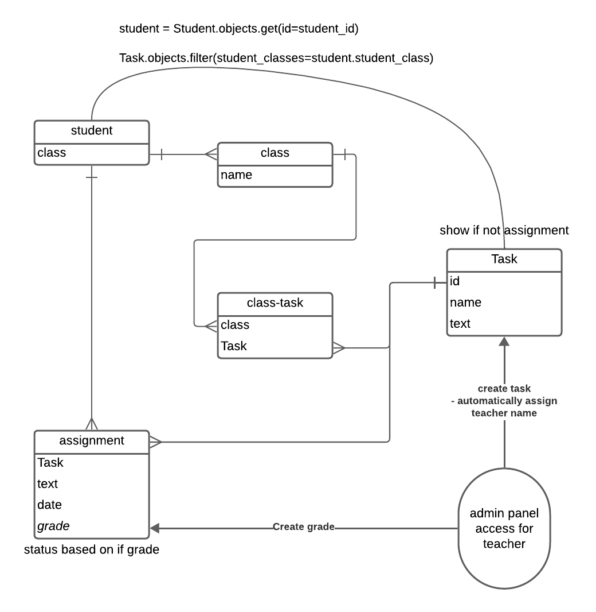

# Доска домашних заданий

О домашнем задании должна храниться следующая информация:

- предмет
- преподаватель
- дата выдачи
- период выполнения
- текст задания
- информация о штрафах

Необходимо реализовать следующий функционал:

- Регистрация новых пользователей.
- Просмотр домашних заданий по всем дисциплинам (сроки выполнения,
  описание задания).
- Сдача домашних заданий в текстовом виде.
- Администратор (учитель) должен иметь возможность поставить оценку за
  задание средствами Django-admin.
- В клиентской части должна формироваться таблица, отображающая оценки
  всех учеников класса.

# Структура сервиса

## Навигация по сайту

```
/
/account
    | /  # Личная информация
    | /register  # страница регистрации
    | /login  # эндпоинт для входа в аккаунт
    | /logout  # эндпоинт для выхода из аккаунта
/tasks
    | /  # список
    | /<int:id>  # конкретное задание
        | /submit  # эндпоинт для сдачи задания
        | /edit  # эндпоинт для реадктирования
    | /pending  # сданные задания без оценки
/grades
    | /  # свои оценки
    | /all  # оценки класса
/admin  # панель для учителей
/about  # задание
```

## Модель данных



# Запуск

## Первый запуск

```zsh
pip install -r requirements.txt
docker run --name pg-container -e POSTGRES_PASSWORD=notsecred -d -p 5432:5432 postgres
python manage.py runserver localhost:8000
```

## Дальнейшие запуски

```zsh
docker start postgres-container
python manage.py runserver localhost:8000
```

# Векторы доработки

- Переделать работу с шаблонами, чтобы не зависеть от контекста
- Вынести логику регистрации и входа в отдельное приложение
- Доработать ui/ux
- Добавить плагинов в админ-панель для удобного редактирования текстовых данных
- Написать docker-compose для удобного деплоя
