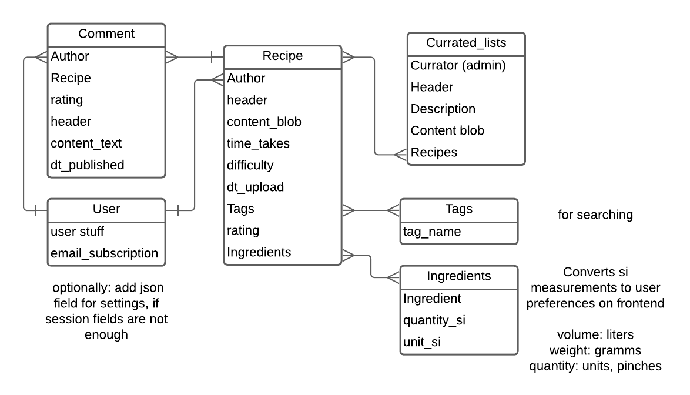

# Задача

Реализация серверной части приложения средствами django и djangorestframework

# Ход работы

Я выбрал вариант, над которым я работаю по дисциплинам "проектирование UI/UX" и 
"Фронтэнд разработка": сайт с кулинарными блогами. Я создал схему данных в нотации 
IDEF1X и согласовал ее с преподавателем. 



Я реализовал получившуюся схему средствами DjangoORM. Далее я описал задачи, которые 
должен отрабатывать API для пользователя. 

- Обрабатывать crud для отдельных рецептов !с аутентификацией
- Обрабатывать crud для комментариев !с аутентификацией
- Получать коллекции рецептов

Я создал следующую структуру для api.  
! обозначает, что для вызова требуется токен авторизации

```
/recipes
    / [GET] - получить краткую информацию о последних 10 рецептах
    / ![POST] - опубликовать рецепт
    /<pk> [GET] - получить полную информацию о рецепте
    /<pk> ![PATCH, DELETE] - crud функционал. Доступен только для автора рецепта
/comments
    / - ошибка, нельзя запрашивать все комментарии
    /?recipe_id=<pk> [GET] - получить все комментарии для конкретного рецепта
    /?recipe_id=<pk> ![POST] - опубликовать комментарий для рецепта
    /<pk> [GET] - получить полную информацию о комментарии
    /<pk> ![PATCH, DELETE] - crud функционал. Доступен только для автора комментария
/lists
    / - получить краткую информацию о всех коллекциях рецептов
    /<pk> - получить полную информацию о коллекции
/admin - админ панель
/auth - djoser аутентификация
```

Для реализации аутентификации я воспользовался функционалом djoser. Это помогло быстро,
безопасно и надежно создать систему аутентификации. Далее я настроил доступность api 
как readonly. Я воспользовался следующими generic классами для упрощения разработки api:
`ListCreateAPIView, RetrieveUpdateDestroyAPIView, ListAPIView, RetrieveAPIView`
Они помогли очень быстро разграничить crud функциональность.  
Для оптимизации запросов к базе данных я денормализовал данные и хранил сумму оценок и 
их количество для каждого рецепта в модели данных. Для синхронизации любых изменений в 
комментариях с моделью, я воспользовался функцией django: сигналами. Следующий код 
следит за изменениями в моделях Comments и пересчитывает поля в рецепте

```python
@receiver(post_save, sender=Comment)
def update_recipe_on_comment_save(sender, instance, created, **kwargs):
    """
    Signal to update Recipe when a Comment is created or updated.
    """
    recipe = instance.recipe
    if created:
        recipe.stars_sum += instance.rating
        recipe.number_ratings += 1
    else:
        recipe.stars_sum = sum(c.rating for c in Comment.objects.filter(recipe=recipe))

    recipe.save()


@receiver(post_delete, sender=Comment)
def update_recipe_on_comment_delete(sender, instance, **kwargs):
    """
    Signal to update Recipe when a Comment is deleted.
    """
    recipe = instance.recipe
    recipe.stars_sum -= instance.rating
    recipe.number_ratings = max(0, recipe.number_ratings - 1)

    recipe.save()
```

Я объявил эти сигналы, зарегистрировал их в приложении и дальше все работало само.

# Выводы

Таким образом я реализовал простой API средствами django, django-rest-framework и 
djoser.