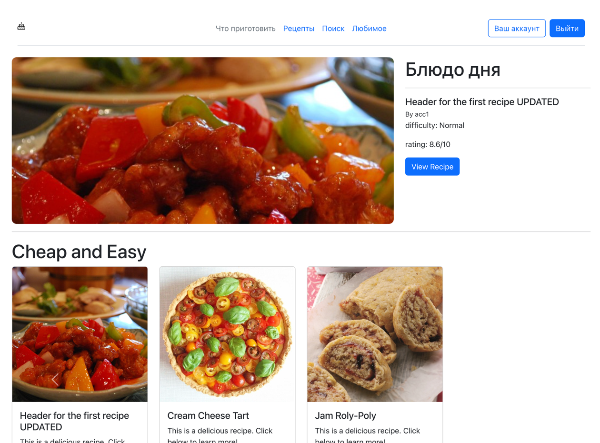
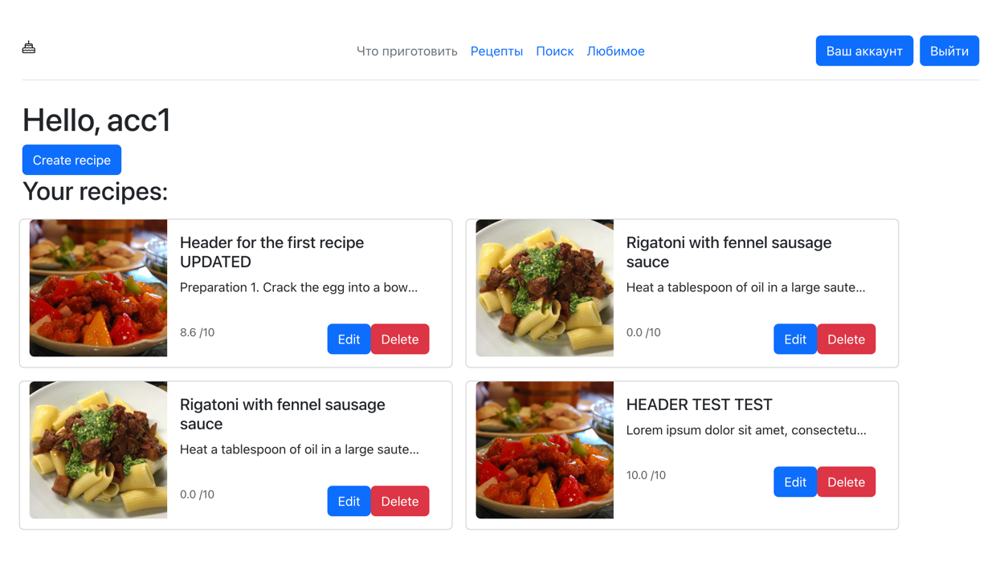
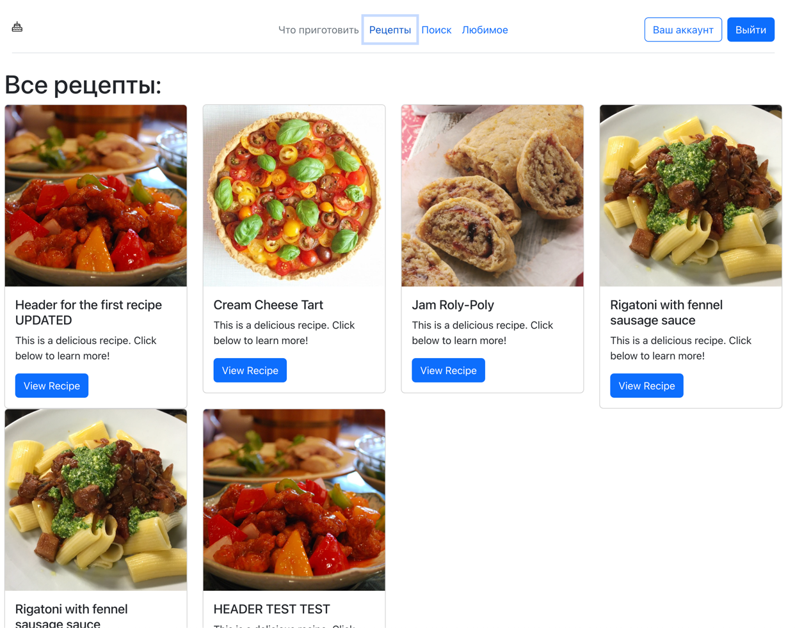
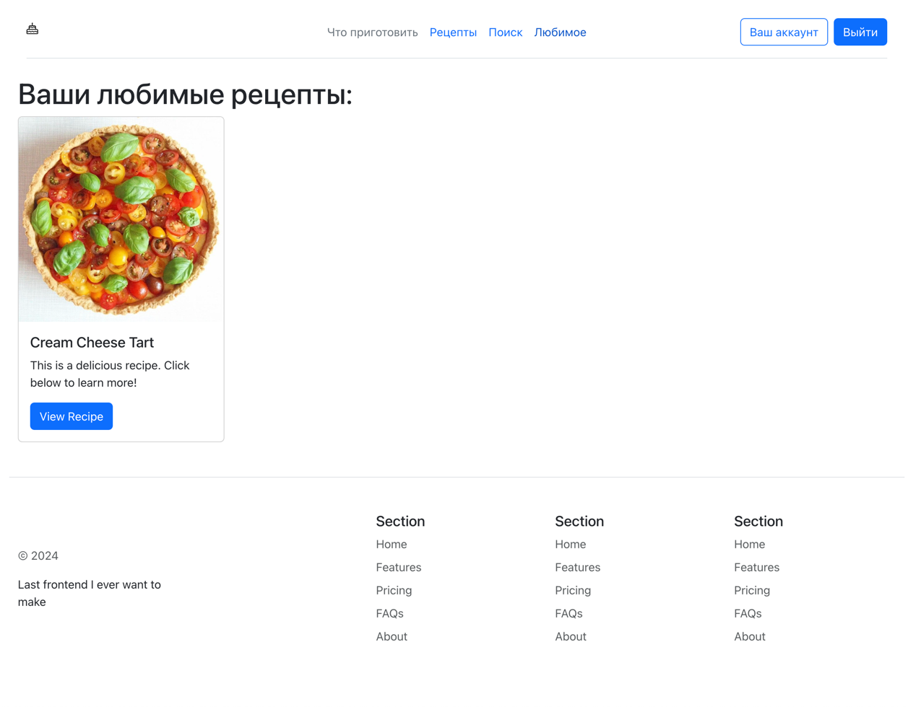
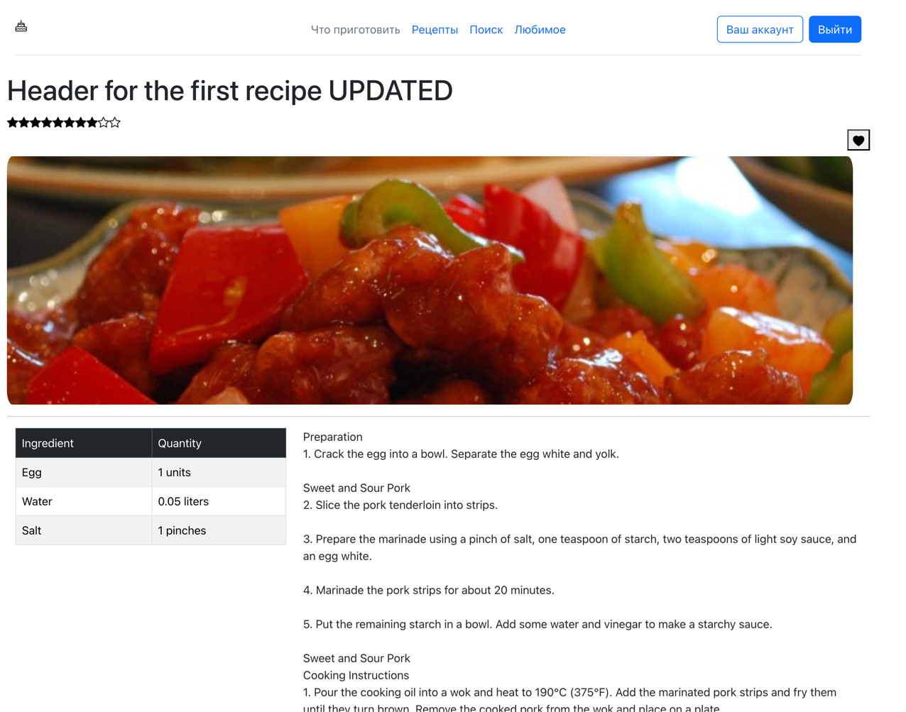
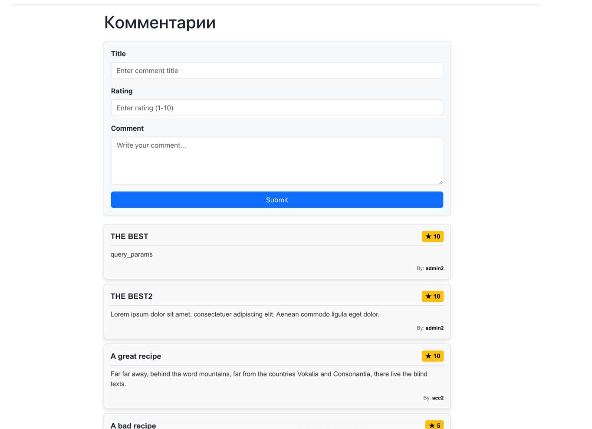
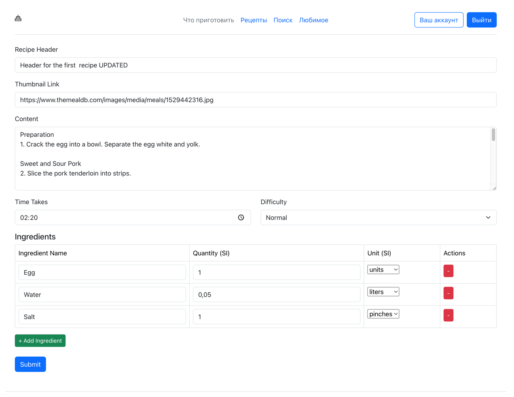
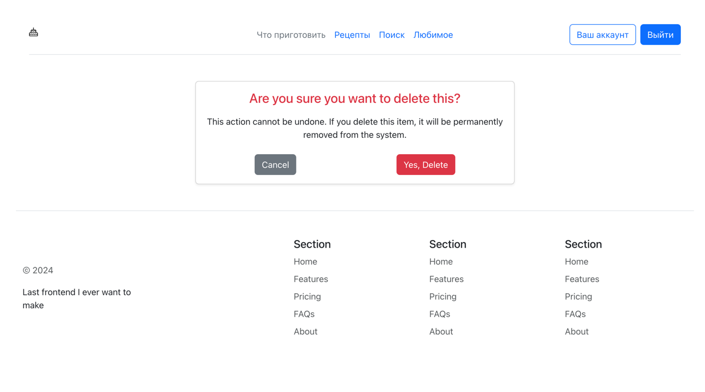
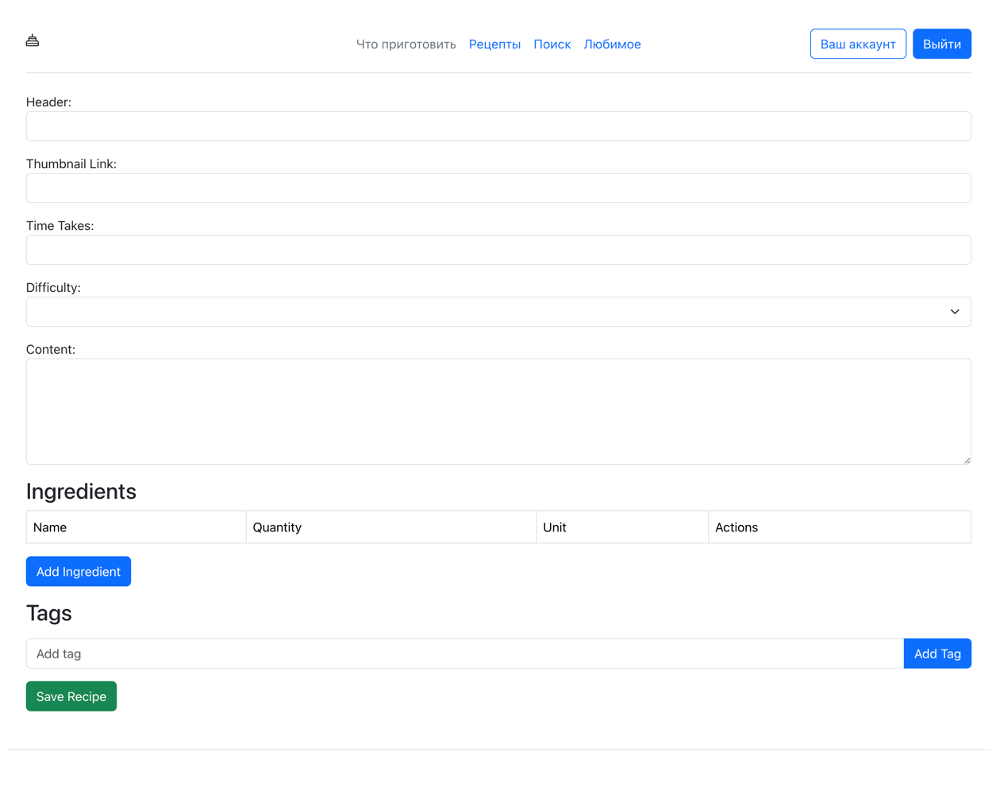

# Задача

У вас должна быть работающая регистрация и авторизация. В каждом варианте есть центральная
таблица из которой больше всего внешних ключей. Для нее должен быть реализован в каком
либо виде список объектов и круд интерфейсы. Из остальных та

# Ход работы

Я создал соответствующие эндпоинты в vue-роутере, описал состовные компоненты 
и представления. Я применял как composition, так и options API, пропсы и сигналы. Для 
стлизации сайта я выбрал использовать стандартные элементы boostrap в комбинации с 
моими кастомными css классами.

Скриншоты интерфейса

**Галвная страница**

---

**Ваши рецепты**

---

**Все рецепты**

---

**Лайки в приложении**

---

**Страница рецепта**

---

**Страница рецепта - создание и коммментарии**

---

**Страница редактирования рецепта**

---

**Страница удаления рецепта**

---

**Страница создания нового рецепта**

# Выводы

Я научился пользоваться VUE для создания реактивных веб SPA